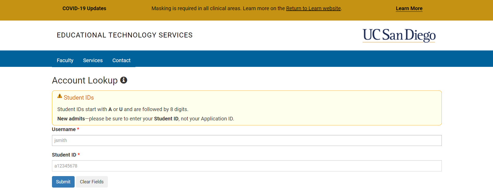
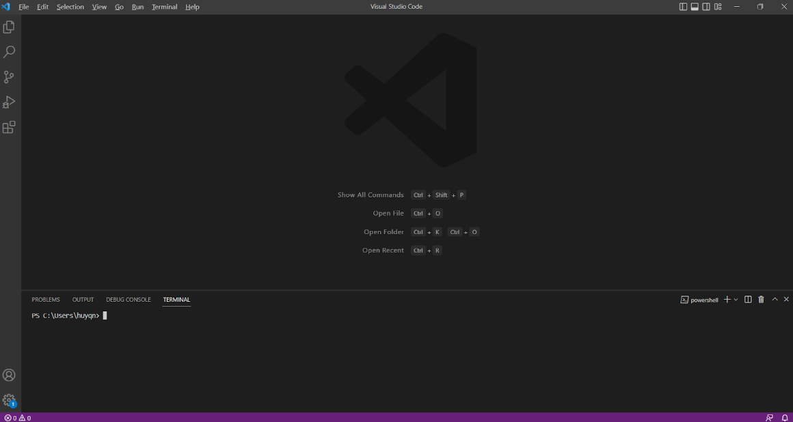
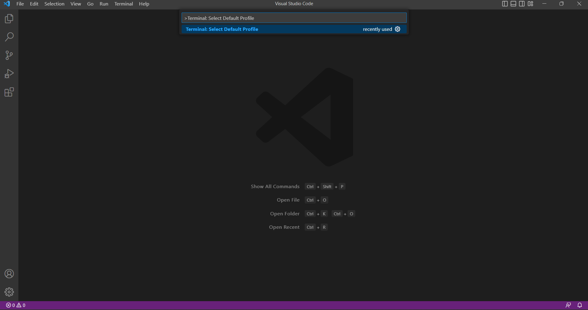
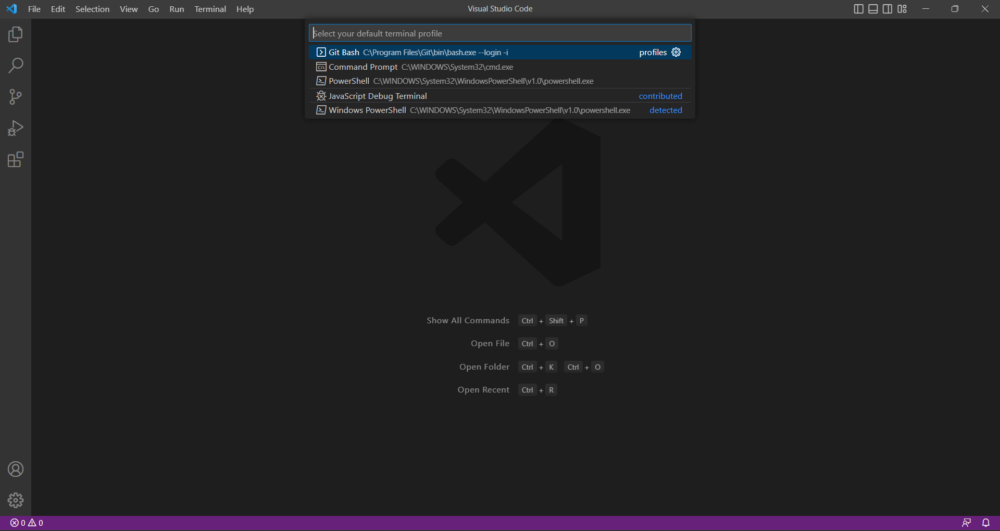
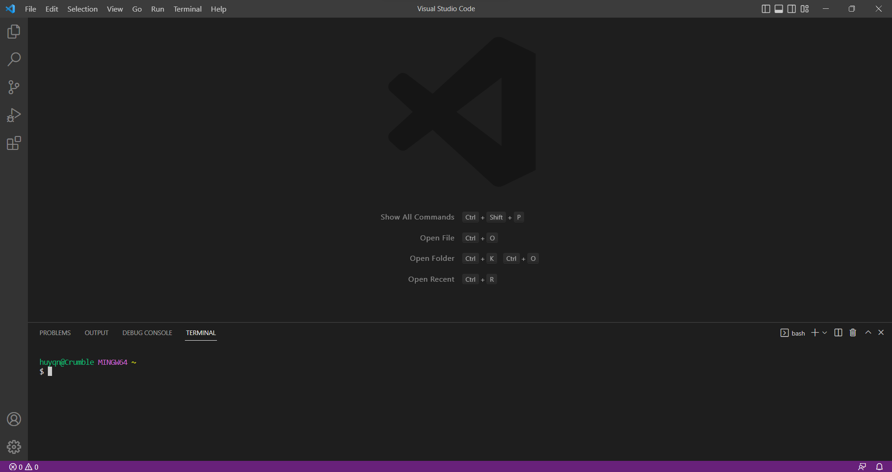
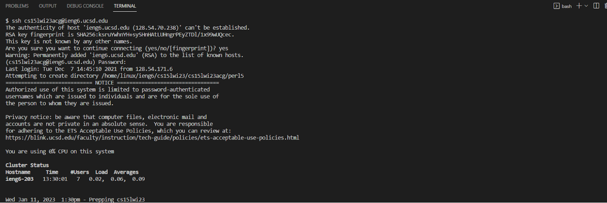
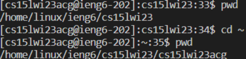

# Lab Report 1 - Remote Access and Filesystem

## Overview

Oftentimes, it is necessary to log into other computers remotely and work with files of that system. In Lab #1, we learned how to log into accounts on other computers. In this guide, you will learn how to remotely log into an account on ieng6 (More specifically an account for CSE 15L, but you can apply this to any course with accounts on ieng6). 

## Requirements

Before we can begin, we need to make sure that we have everything set up so that we can actually remotely connect.

### Account Username 

You're going to need your account username for your course before you can log onto an account on ieng6.
To find your username, head to https://sdacs.ucsd.edu/~icc/index.php. Under account look up, enter your name
and PID, and your account username will be displayed. Here, you can also set your password, which you should do now. For CSE 15L, your 
account username should look something like this:
`cs15lwi23***`

## Installing VSCode, Git, and working with Bash

- Visual Studio Code can be downloaded here: https://code.visualstudio.com/
- Git can be downloaded here: https://gitforwindows.org/

Next, we're going to need to install a couple of things if they're not already installed: Visual Studio Code and Git.
Navigate to the links above, press the download button, and run the downloaded file. This will run an installation wizard
that you can follow to install both to your computer. 

Now we can change the default terminal of Visual Studio Code to Bash:

- Open Up Visual Studio Code

- Set your default terminal to Bash by pressing `ctrl + shift + p` and searching for: `Terminal: Select Default Profile` and then selecting `Git Bash`

- Open a terminal by clicking terminal and then new terminal or by pressing `ctrl + shift + `\`

## Remotely Connecting

- In your new Bash terminal, type the following: `ssh yourUsername@ieng6.ucsd.edu`
- You will likely be prompted with a message about "the authenticity of the host", to which you can reply yes to as it is your first time connecting.
- It will then prompt you for your password, which you should enter. *Note: It will seem like no input is being received as no characters pop up; just type in your password and hit enter*

Once these steps have been taken, a remote connection should be established

## Working Remotely (Trying Some Commands)

Now that you have logged in remotely, you can start working with the files on that computer:

In this particular example, the commands pwd and cd were used to really emphasize the fact that there is a remote connection, and that you can now work with files on a remote computer. The present working directory indicates that the files exist on a computer running Linux, whereas the computer on which VS code is being used is running windows.

## Now you know how to remotely log into an account on ieng6 and interact with the computer!
