# Lab Report 1 - Remote Access and Filesystem

## Overview

Oftentimes, it is necessary to log into other computers remotely and work with files of that system. In Lab #1, we learned how to log into accounts on other computers. In this guide, you will learn how to remotely log into an account on ieng6 (More specifically an account for CSE 15L, but you can apply this to any course with accounts on ieng6). 

## Requirements

Before we can begin, we need to make sure that we have everything set up so that we can actually remotely connect.

### Account Username and Password

You're going to need your account username for your course before you can log onto an account on ieng6.
To find your username, head [here](https://sdacs.ucsd.edu/~icc/index.php). Under account look up, enter your name
and PID.

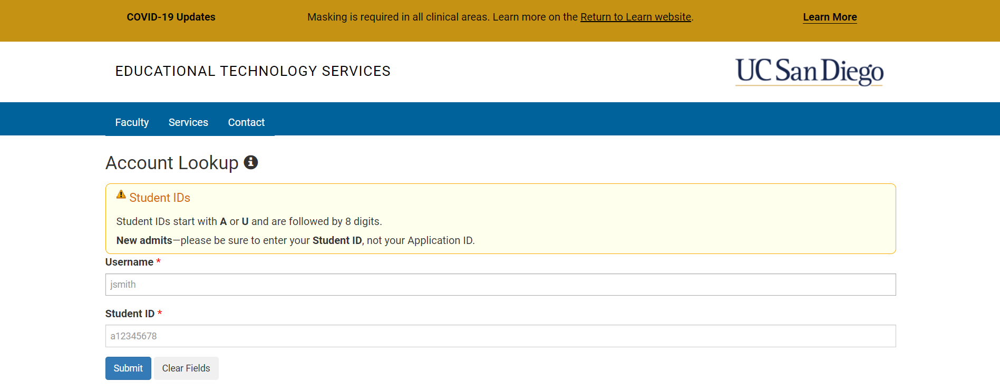

After entering this information, you should see a page like the one below. Your username will be under additional accounts. For CSE 15L, your 
account username should look something like this:
`cs15lwi23***` 

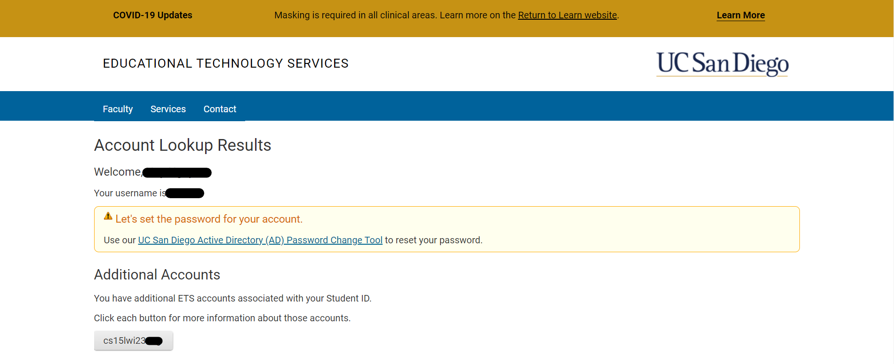

From the page above, you can also click on the [UC San Diego Active Directory (AD) Password Change Tool](https://sdacs.ucsd.edu/~icc/password.php) link to reset your account password if you have not already. Clicking on that should take you to the page shown below:

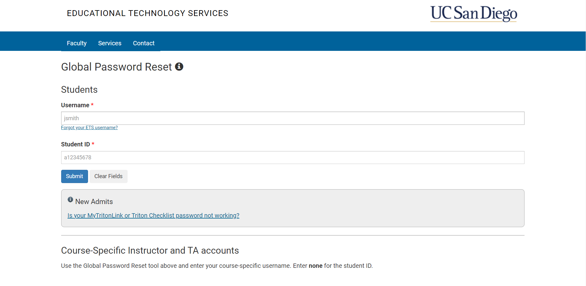

Just enter in the information you provided on the earlier page, and it will lead you to the following page:

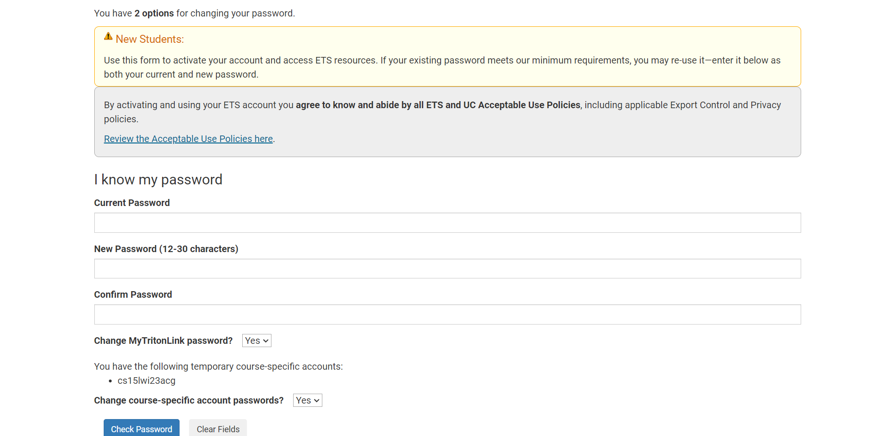

From here, you can change the password to both your course account and your MyTritonLink account, or just your course account. Now that you have both your course account username and password, we can move on to the next steps!

## Installing VSCode, Git, and working with Bash

- [Download Visual Studio Code](https://code.visualstudio.com/)
- [Download Git](https://gitforwindows.org/)

Next, we're going to need to install a couple of things if they're not already installed: Visual Studio Code and Git.
Navigate to the links above, press the download button, and run the downloaded file. This will run an installation wizard
that you can follow to install both to your computer. 

Now we can change the default terminal of Visual Studio Code to Bash:

- Open Up Visual Studio Code

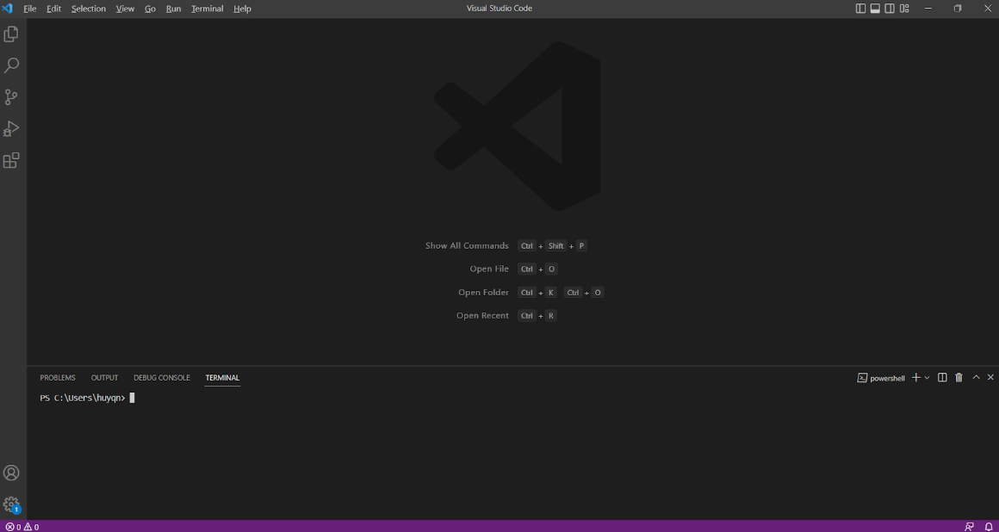

- Set your default terminal to Bash by pressing `ctrl + shift + p` and searching for: `Terminal: Select Default Profile` and then selecting `Git Bash`

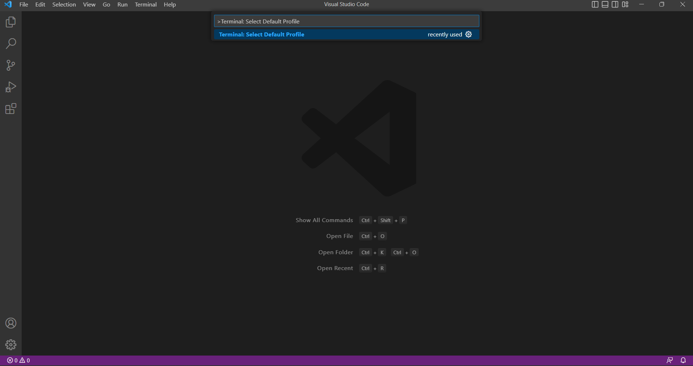

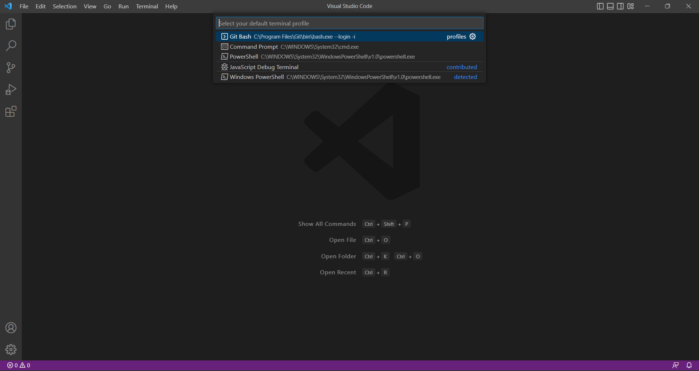

- Open a terminal by clicking terminal and then new terminal or by pressing `ctrl + shift + `\`

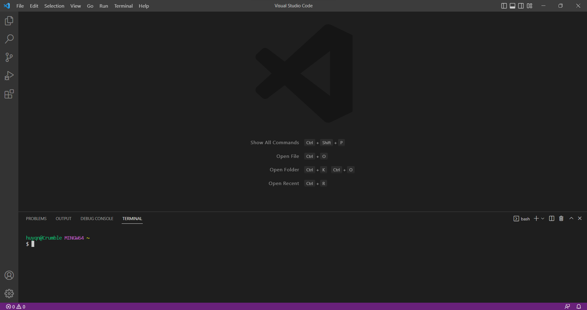

## Remotely Connecting

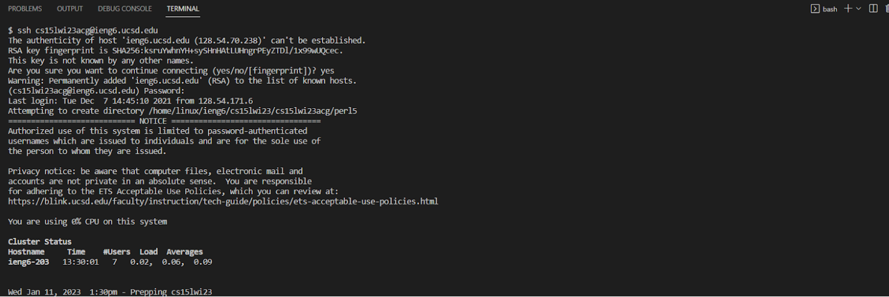

- In your new Bash terminal, type the following: `ssh yourUsername@ieng6.ucsd.edu`
- You will likely be prompted with a message about "the authenticity of the host", to which you can reply yes to as it is your first time connecting. (You can see this in the second to fifth lines in the terminal in the screenshot above)
- It will then prompt you for your password, which you should enter (Seen in line six) 
    - *Note: It will seem like no input is being received as no characters pop up; just type in your password and hit enter*

Once these steps have been taken, a remote connection should be established, and you should see some messages about your usage of the computer's resources (seen after the notice in the screenshot above)

## Working Remotely (Trying Some Commands)

Now that you have logged in remotely, you can start working with the files on that computer:

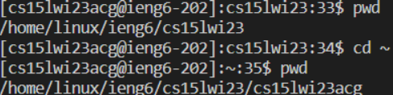

In this particular example, the commands ```pwd``` and ```cd``` were used to really emphasize the fact that there is a remote connection, and that you can now work with files on a remote computer. ```pwd``` displays the present working directory of the remote computer, and ```cd``` changes the present working directory. The present working directory shown in the image above indicates that the files exist on a computer running Linux, whereas the computer on which VS Code is being used is running windows.

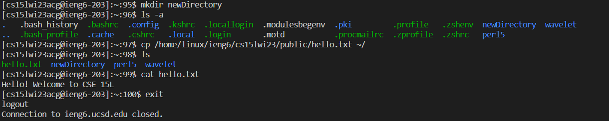

Here are some other commands that can be ran, starting from the top of the image above, going down:

- ```mkdir (newDir)``` - This command, when used with an argument, will create a new file in the present working directory with the argument as its name. In the image above, a new directory was created called newDirectory
- ```ls``` - This command is used to list the files and directories in the present working directory. In the image above, you can see the newly created newDirectory, as well as other files in the present working directory
    - Note: files should be displayed in green and directories should be displayed in blue
    - You can use the ```a``` flag to list hidden files and directories as well: ```ls -a```
    - You can use the ```l``` flag to make it so that each file and directory is displayed on a new line, instead of having multiple on one line like the image above: ```ls -l```
    - You can combine several flags to combine their effects: ```ls -la```
- ```cp (filePath) (path)``` - This command copies a file to the location specified in the second argument. In the example above, hello.txt was copied from the public folder to the home directory
- ```cat (filePath)``` - This command displays the contents of a file, which in the example was hello.txt

## Now you know how to remotely log into an account on ieng6 and interact with the computer!
