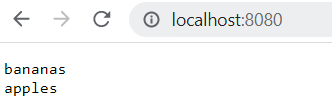

# Lab Report 2 - Servers and Bugs

## StringServer

While working with servers, we made a webserver that would take a query and add it on to a "list" of strings.

### Code

```
import java.io.IOException;
import java.net.URI;

class Handler implements URLHandler {

    String returnString = "";

    public String handleRequest(URI url) {

        if (url.getPath().equals("/")) {

            return returnString;

        } else {
            
            if (url.getPath().equals("/add-message")) { 
        
                String[] parameters = url.getQuery().split("=");

                if(parameters[0].equals("s")) {
                
                    returnString += parameters[1] + "\n";
                    return returnString;

                }

            }
            
            return "404 Not Found!";

        }

    }

}

class StringServer {

    public static void main(String[] args) throws IOException {

        if(args.length == 0){

            System.out.println("Missing port number! Try any number between 1024 to 49151");
            return;

        }

        int port = Integer.parseInt(args[0]);

        Server.start(port, new Handler());

    }

}
```

### Web Server at Work

For this example, we ran the main method, with an argument of 8080 to direct the web server to use port 8080. On running the web server, an empty string called ```returnString``` was created.


For the image above, we used the went to http://localhost:8080/add-message?s=bananas to add "bananas" to our list of strings. By going to this url, we called the ```handleRequest(URI url)``` method, passing http://localhost:8080/add-message?s=bananas as our argument for url. We then called the ```getPath()``` method to get the path of our link. From there, we checked if the path equaled (using ```equals()```) "/" or "/add-message". Since this equaled "/add-message", we called the ```getQuery()``` method and the ```split("=")``` creating the array, ```parameters```, equal to ```{ s, bananas }``` We then checked whether the first part of this array was equal to "s", and since it was here, we added ```"bananas\n"``` to ```returnString``` and then returned it, causing it to display in the image above.


Similarly to the example above we used the went to http://localhost:8080/add-message?s=apples to add "apples" to our list of strings. By going to this url, we called the ```handleRequest(URI url)``` method, passing http://localhost:8080/add-message?s=apples as our argument for url. We then called the ```getPath()``` and ```equals()``` to compare the path to "/" and "/add-message". Like in the previous example, the path was "/add-message",so we called the ```getQuery()``` method and the ```split("=")``` method to, producing ```parameters```, equal to ```{ s, apples }```. We then verified that the first part of the array was equal to "s", and then we added ```"apples\n"``` to ```returnString```. We then returned ```returnString```, which now contained both "bananas" and "apples", so both displayed on the webpage.



For this example, we went to http://localhost:8080/. After passing this to ```handleRequest(URI url)```, we again, called ```getPath()``` and ```equals()``` to compare the path to "/". Since the path was "/", we simply returned ```returnString```, resulting which already contained bananas and apples. ```parameters``` was not created as ```getQuery``` was not called, and ```returnString``` did not update as it was only returned.


For this example, we went to http://localhost:8080/error. After passing this to ```handleRequest(URI url)```, we again, called ```getPath()``` and ```equals()``` to compare the path to "/" and "/add-message". Since the path equaled neither, we returned an error message. ```parameters``` was not created as ```getQuery``` was not called, and ```returnString``` did not update as it was only the error message was returned.

## Lab 3 Bugs

### Overview

In Lab 3, we forked [this repository](https://github.com/ucsd-cse15l-w23/lab3), and we analyzed a java file called LinkedListExample.java which was meant to behave like a linked list. It was implemented using nodes as the backbone of the data structure, and looks a little bit like the following:

```
// Implementation of the Linked List
// Source: https://github.com/ucsd-cse15l-w23/lab3

import java.util.NoSuchElementException;

class Node {
    int value;
    Node next;
    public Node(int value, Node next) {
        this.value = value;
        this.next = next;
    }
}
class LinkedList {
    Node root;
    public LinkedList() {
        this.root = null;
    }
    // Methods...
}
```

Within this LinkedListExample.java file, there were several methods that we looked at and tested, including but not limited to: ```prepend(int value)```, ```append(int value)```, ```first()```, and ```last()```. During testing, there was a bug that was found with the ```append(int value)``` method:

### ```append(int value)``` Before the Bug Fix

The following code is the method that we examined:

```
//method in the LinkedList class
//Source: https://github.com/ucsd-cse15l-w23/lab3

public void append(int value) {
    if(this.root == null) {
        this.root = new Node(value, null);
        return;
    }
    // If it's just one element, add if after that one
    Node n = this.root;
    if(n.next == null) {
        n.next = new Node(value, null);
        return;
    }
    // Otherwise, loop until the end and add at the end with a null
    while(n.next != null) {
        n = n.next;
        n.next = new Node(value, null);
    }
}
```

### Input That Doesn't Induce Failure

```
public class LinkedListTests {

    private LinkedList list;
    
    @Before
    public void setUp() throws Exception {

        list = new LinkedList();

    }

    @Test 
    public void testAppendTwo() {

        list.append(1);
        assertEquals(1, list.root.value);
        assertEquals(null, list.root.next);
        list.append(2);
        assertEquals(1, list.root.value);
        assertEquals(2, list.root.next.value);
        assertEquals(null, list.root.next.next);

    }

    // Other Tests

}
```

The input above, appends 2 values to a list, which should result in a list with 2 nodes with values in this order: 1, 2. After testing this input, we find that it successfully does that.

### Failure Inducing Input

```
public class LinkedListTests {

    private LinkedList list;
    
    @Before
    public void setUp() throws Exception {

        list = new LinkedList();

    }

    @Test 
    public void testAppendThree() {

        list.append(1);
        assertEquals(1, list.root.value);
        assertEquals(null, list.root.next);
        list.append(2);
        assertEquals(1, list.root.value);
        assertEquals(2, list.root.next.value);
        assertEquals(null, list.root.next.next);
        list.append(3);
        assertEquals(1, list.root.value);
        assertEquals(2, list.root.next.value);
        assertEquals(3, list.root.next.next.value);
        assertEquals(null, list.root.next.next.next);

    }

    // Other Tests

}
```

The input above, appends 3 values to a list, which should result in a list with 3 nodes with values in this order: 1, 2, 3. Unfortunately, when testing this input, this did not happen.

### Bug Symptoms


Instead of ```testAppendThree()``` creating a list with 3 nodes with values in the order listed above, the input caused the method to overload our memory:


### Fixing the Bug

```
//method in the LinkedList class
//Source: https://github.com/ucsd-cse15l-w23/lab3

public void append(int value) {
    if(this.root == null) {
        this.root = new Node(value, null);
        return;
    }
    // If it's just one element, add if after that one
    Node n = this.root;
    if(n.next == null) {
        n.next = new Node(value, null);
        return;
    }
    // Otherwise, loop until the end and add at the end with a null
    while(n.next != null) {
        n = n.next;   
    }
    //removed from inside of the loop and placed outside
    n.next = new Node(value, null); 
}
```

After close examination of the bug, it was found that there was the line ```n.next = new Node(value, null)``` inside of the while loop. The while loop continues until ```n.next == null```. With the line mentioned above inside the for loop, after every addition to the list, ```n.next``` is set to a new node that is not equal to ```null```, thus causing the whilel loop to go on forever. Moving the statement outside of the while loop results in the test case passing.


## Learning

For labs 2 and 3, I learned a lot about how to create simple web servers, and interact with them using the paths. I also realized how helpful testing, especially with JUnit, can be in catching bugs and fixing them. Previously, I used to manually test my code, but JUnit makes it much easier and more efficient.