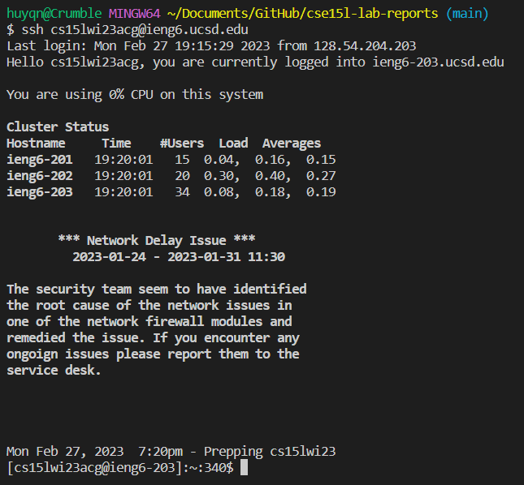
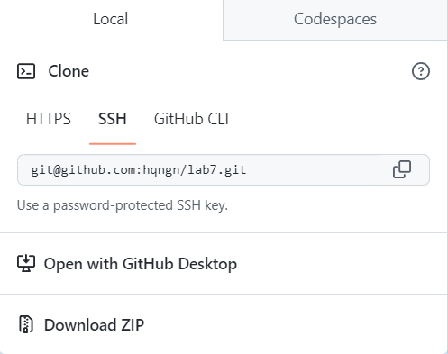
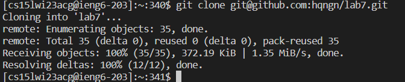
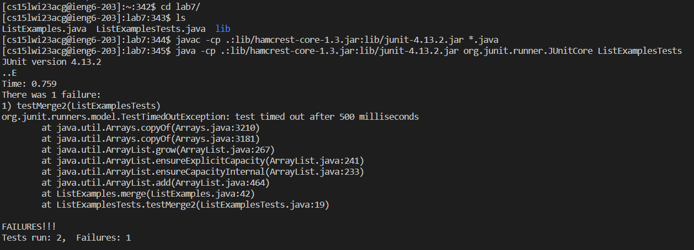
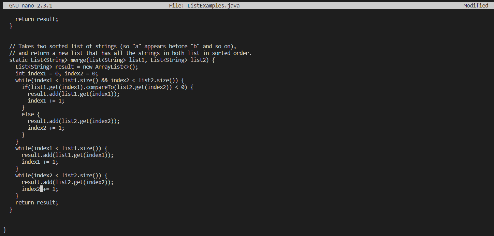
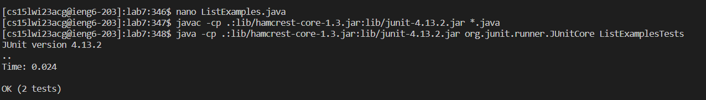
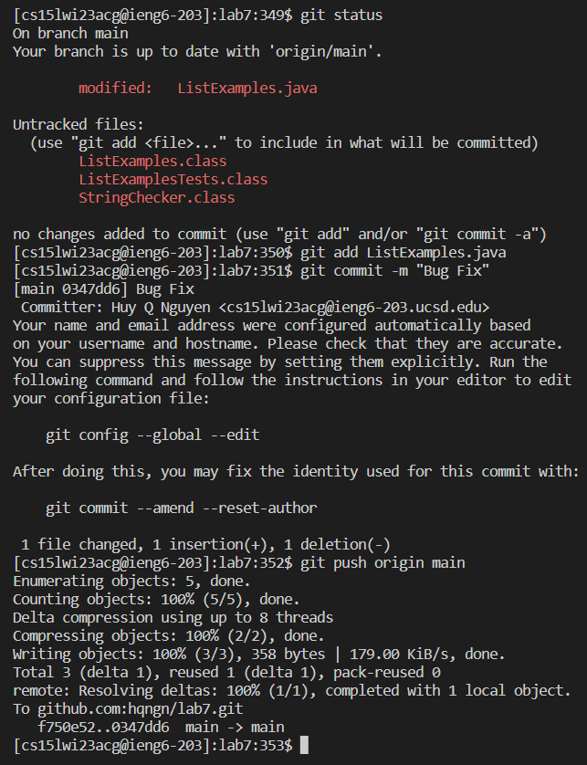

# Lab Report 4 - Week 7 Lab

## Overview

For week 7's lab, we cloned a forked repository, fixed a bug, and pushed the changes to the repository through the command line. The instructions were as follows [(source)](https://ucsd-cse15l-w23.github.io/week/week7/#lab-tasks):

1. Log into ieng6
2. Clone your fork of the repository from your Github account
3. Run the tests, demonstrating that they fail
4. Edit the code file to fix the failing test
5. Run the tests, demonstrating that they now succeed
Commit and push the resulting change to your Github account (you can pick any commit message!)

## Step 1



First, we logged into our lab accounts on ieng6. To do this, I typed ```ssh cs15lwi23acg@ieng6.ucsd.edu```, where ```cs15lwi23acg@ieng6.ucsd.edu``` was my lab account. I did not have to provide a password because I used ```ssh-keygen``` to generate an ssh key for ieng6.

## Step 2





We then cloned our forked lab repository using the ssh link on github. You can see the link in the first image passed as an argument for ```git clone``` in the second image. This clones the repository. This is possible since we used ```ssh-keygen``` to produce an ssh authentication key on ieng6 for github.

## Step 3



After cloning the repository, we went into the directory using ```cd``` and then ran the tests with ```javac -cp .:lib/hamcrest-core-1.3.jar:lib/junit-4.13.2.jar``` and ```java -cp .:lib/hamcrest-core-1.3.jar:lib/junit-4.13.2.jar org.junit.runner.JUnitCore ListExamplesTests```. We can see that 1 of 2 tests have failed in the output above.

## Step 4



We then had to fix the bug. To do so, we entered ```nano ListExamples.java``` to open the command line text editor to the source file and then pressed the ```<down>``` key 42 times, the ```<right>``` key 2 times, pressed ```<backspace>``` once,
and ```<2>``` once. We then pressed ```<^o>``` to save, ```<enter>``` to confirm the file name, and ```<^x>``` to exit nano. This changes the 1 in line 43 to a 2 (as seen above), stopping the infinite loop produced by a conditional that can never be satisfied

Keys: ```<down><down><down><down><down><down><down><down><down><down><down><down><down><down><down><down><down><down><down><down><down><down><down><down><down><down><down><down><down><down><down><down><down><down><down><down><down><down><down><down><down><down><right><right><backspace><2><^o><enter><^x>```

## Step 5



I then used the ```<up>``` key 3 times to run ```javac -cp .:lib/hamcrest-core-1.3.jar:lib/junit-4.13.2.jar``` since we used it 3 commands ago. I used the ```<up>``` key another 3 times to run ```java -cp .:lib/hamcrest-core-1.3.jar:lib/junit-4.13.2.jar org.junit.runner.JUnitCore ListExamplesTests``` since we used it 3 commands ago. This is possible as they are stored in my bash history. As we can see above, both tests have now passed.

Keys: ```<up><up><up><enter><up><up><up><enter>```



We then had to push the changes to our github repository. I used ```git status``` to check for any altered files. After that, I ran ```git add``` to add the changes to our commit. ```git commit -m``` was then used to commit the changes with a message, and finally ```git push origin main``` was ran to push the changes. We were able to do this without entering in our github username and password because we had added an ssh authentication key to github previously and cloned the repository using the ssh link.